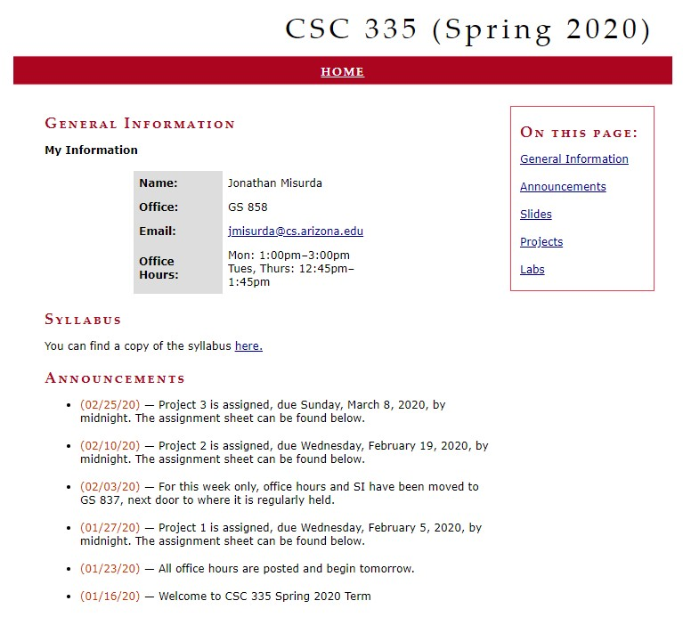
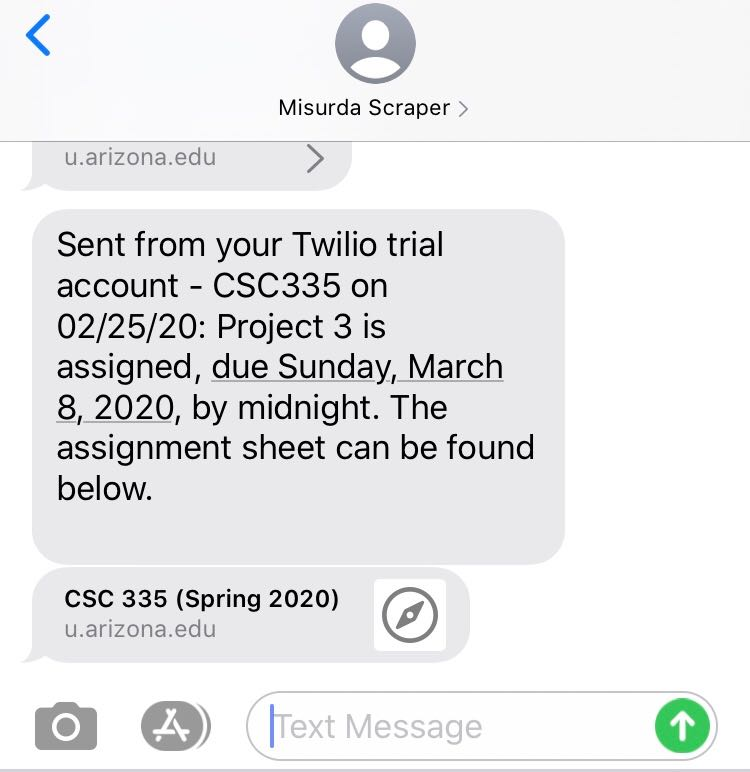

# Misurda Scraper

## Purpose
I'm a UArizona student and my professor uses his own website over D2L. As a result, I don't get any notifications when new announcements/assignments are posted. One day it dawned on me -- I'm a Computer Science major performing the repetetive task of visiting a website daily (or more) to see if anything new was posted.

I spent a few hours writing this script to solve my problem. It scrapes the class website for announcements and tries to insert them into a MySQL database. If there is an error, the announcement is passed. If it goes in, then the announcement is assumed to be new and the text content of that announcement is texted to my phone via Twilio.

This script is set to run once per hour on my Raspberry Pi at home on my desk. The Pi also has a LAMP server, facilitating the MySQL database.

## Required Libraries
`beautifulsoup4`  
`requests`  
`twilio`  
`mysql-connector`

## Future Ideas
The code can definitely be cleaned up. I've done almost no error handling. I'd like to add code to check for existing databases and/or tables and create them if they're not available. He will also post assignments without an announcement, so that could cause problems.

## Screenshots
  

